# Graph Representation Learning on Relational Sports Data: GCN and GAT with Interpretable Attention for Match Outcome Prediction

*Encoding team passing behaviour as weighted directed graphs and learning
over relational structure with GCN and GAT — does topology carry signal
beyond aggregate statistics?*

Aggregate match statistics — possession percentage, total passes,
shots on target — flatten the relational structure of a team's play
into a single row of numbers. This project asks whether encoding
that structure explicitly as a weighted directed graph, and learning
over it with Graph Neural Networks, recovers predictive signal that
aggregation discards. Each team in each match is represented as a
player-interaction graph: nodes carry positional and pass-quality
features, directed edges carry frequency, success rate, and mean
length. A shared-weight dual encoder produces one graph embedding
per team; the pair is classified by an MLP. The central finding is
that GNNs outperform a logistic regression baseline receiving the
same features flattened (GAT F1 0.613 vs LR 0.583), isolating graph
topology as the source of the gain — and that two interpretability
methods applied to the same models identify entirely different
player relationships (GNNExplainer vs GAT attention mean Jaccard
0.106, at or below random baseline 0.131).

## Key Findings

Five headline results from training and evaluating on 380 La Liga 2015/16 matches:

1. **GNNs outperform tabular baselines on macro F1.** GAT achieves F1 0.613 vs logistic regression's 0.583, even though LR receives the same underlying features flattened. The gap is attributable to graph topology, not feature richness.

2. **GAT reaches 68.4% accuracy**, the best of all four models. Away-win precision of 0.80 suggests the edge-conditioned attention mechanism identifies genuine network dominance in visiting teams.

3. **Both models degrade without the second half, and GAT degrades more.** Restricting to first-half graphs drops GAT accuracy by **−19.3 pp** and GCN by **−10.6 pp**. The GAT's edge-conditioned attention relies on richer per-edge statistics that accumulate over 90 minutes; GCN's simpler scalar weighting is less sensitive to that variance.

4. **Draws are consistently hardest to predict** (best F1: 0.538), reflecting their inherent tactical ambiguity, a finding consistent across GCN, GAT, and the logistic regression baseline.

5. **GNNExplainer and GAT attention disagree on which edges matter.** Across 6 test matches, the top-25 edges identified by GNNExplainer (post-hoc, on the GCN) and by GAT attention (intrinsic) overlap with mean Jaccard **0.106**, at or below a random baseline of **0.131**. Interpretability methods that both look reasonable can identify entirely different signals.

## Dataset

**StatsBomb open data — La Liga 2015/16**

| Property | Value |
|---|---|
| Matches | 380 |
| Home wins / Draws / Away wins | 183 / 92 / 105 |
| Event types used | Pass, Position |
| Graphs per match | 2 (one per team) |
| Mean nodes per graph | 18.0 (players who appeared) |
| Mean edges per graph | 115 (directed pass interactions) |
| Node feature dimension | 28 |
| Edge feature dimension | 3 |
| Train / Val / Test split | 266 / 57 / 57 (70 / 15 / 15 %) |

Data is fetched via [`statsbombpy`](https://github.com/statsbomb/statsbombpy)
and cached locally under `data/raw/` as pickles to avoid repeat network calls.

## Graph Construction

### Nodes — one per player who appeared in the match

| Index | Feature | Description |
|---|---|---|
| 0-24 | Position one-hot | 25 StatsBomb position categories |
| 25 | Completion rate | Successful passes / total passes |
| 26 | Pressure rate | Passes made under pressure / total passes |
| 27 | Progressive rate | Passes advancing >= 10 m toward opponent goal / total passes |

### Edges — directed, passer to recipient

| Index | Feature | Description |
|---|---|---|
| 0 | Normalised pass count | Count between this pair / max count in graph |
| 1 | Pass success rate | Completed passes between this pair / total |
| 2 | Mean pass length | Mean distance in metres / 100 |

Only passes with a recorded recipient are included.
Self-passes (data artefacts) are discarded.

## Model Architectures

Both models share the same **dual-encoder** design:

```
home graph --+                    +-- graph embedding h_home
             +-- shared GNN ------+
away graph --+    encoder         +-- graph embedding h_away

[h_home | h_away] --> MLP --> logits (3 classes)
```

The same encoder weights are used for both teams, enforcing that the model
learns team-agnostic passing-network representations.

### GCN

- Stack of `GCNConv` layers with `BatchNorm` + `ReLU` + `Dropout`
- Edge features are projected to a scalar weight (sigmoid-gated) passed as
  `edge_weight` to `GCNConv`, so the adjacency is soft-weighted by pass quality
- Graph-level pooling: global mean

### GAT

- Stack of `GATv2Conv` layers (Brody et al., 2022) with `BatchNorm` + `ReLU`
- `edge_dim=3`: attention coefficients depend on source node, destination
  node, **and** the pass-relationship features simultaneously
- 4 attention heads; `head_dim = hidden_dim / heads`
- Attention weights are stored after every forward pass for interpretability
- Graph-level pooling: global mean

### MLP Classifier (shared)

```
Linear(2 x hidden_dim, hidden_dim) -> ReLU -> Dropout -> Linear(hidden_dim, 3)
```

**Hyper-parameters:** `hidden_dim=64`, `num_layers=3`, `dropout=0.3`,
`lr=1e-3`, `weight_decay=1e-4`, class-weighted cross-entropy,
`ReduceLROnPlateau(factor=0.5, patience=7)`, early stopping (patience=15).

## Results

All results are on the held-out test set (57 matches) using the
best validation checkpoint. Each model was trained in a single run;
see Limitations for variance implications.

| Model | Accuracy | F1 Macro | F1 Weighted | Home Win F1 | Draw F1 | Away Win F1 |
|---|---|---|---|---|---|---|
| MLP Baseline | 0.474 | 0.385 | 0.444 | 0.583 | 0.190 | 0.381 |
| Logistic Regression | 0.667 | 0.583 | 0.653 | 0.794 | 0.455 | 0.500 |
| **GCN** | **0.632** | **0.617** | **0.637** | 0.689 | 0.529 | 0.632 |
| **GAT** | **0.684** | **0.613** | **0.666** | 0.767 | 0.538 | 0.533 |

**Key observations:**

Both GNN models achieve **higher macro F1 than logistic regression** (0.617 and 0.613 vs 0.583), confirming that graph structure carries signal beyond aggregate statistics. The logistic regression receives the same underlying features, just flattened, so the gap is attributable to the graph topology. GAT achieves the **best raw accuracy** (68.4%) with notably high home-win recall; away-win precision of 0.80 suggests the attention mechanism identifies when the visiting team's network is genuinely dominant. The MLP baseline, also given flattened graph features, performs worst, showing that the value added by GNNs comes from exploiting graph structure, not merely from having access to pass-derived features. **Draws are the hardest class** across all models (best F1: 0.538): this is not a modelling failure but reflects that draws are tactically ambiguous and often decided by moments that don't appear in passing network statistics.

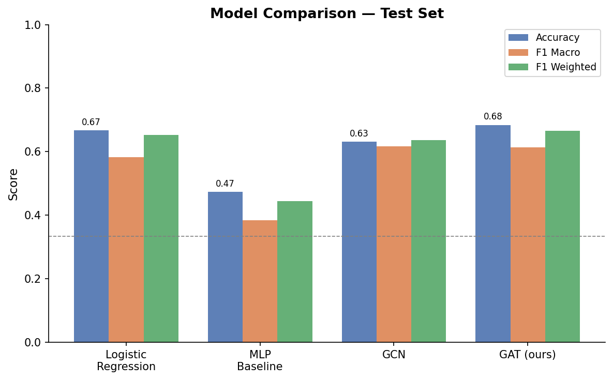
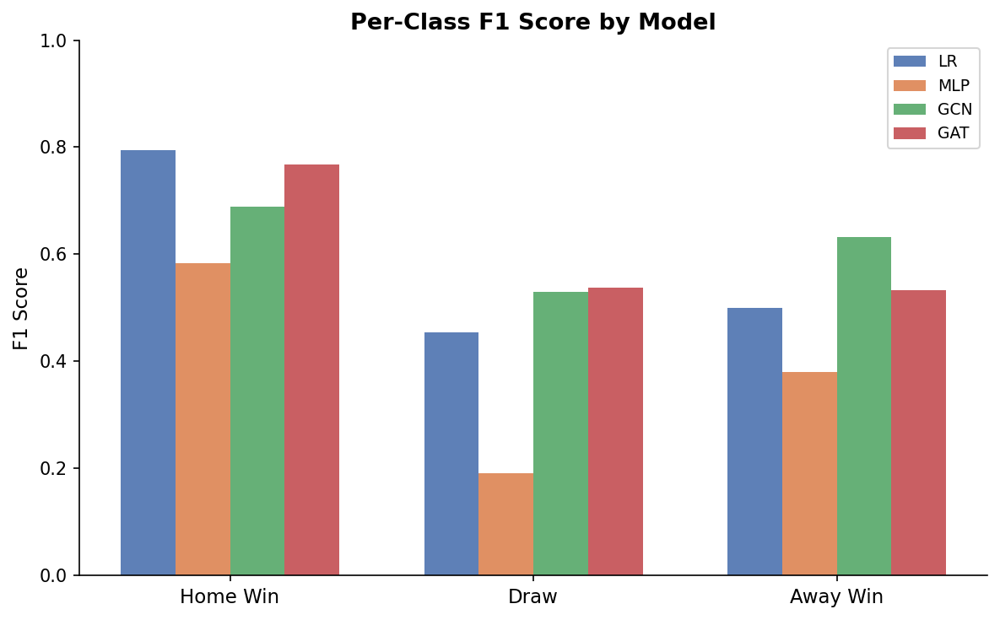
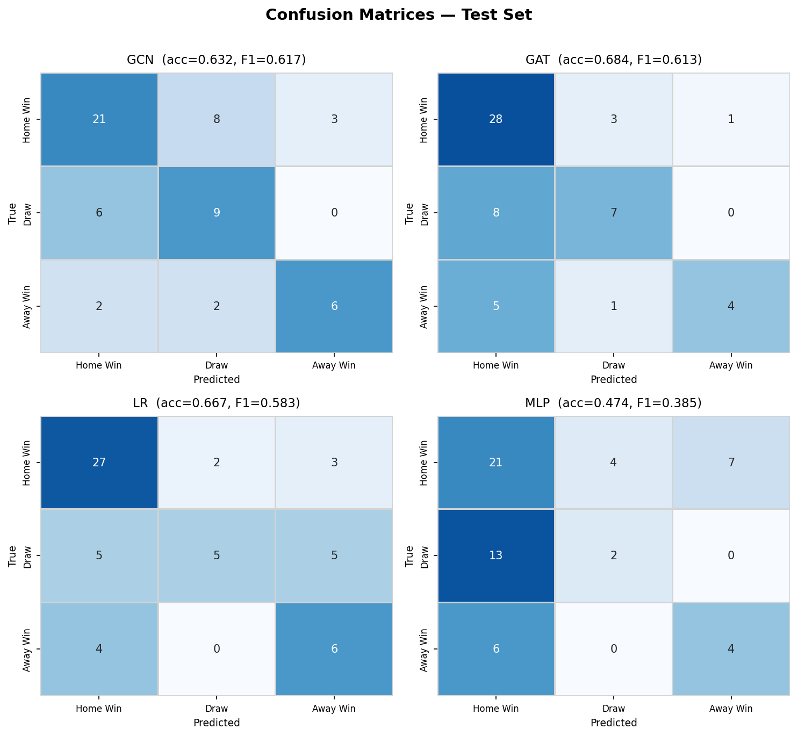
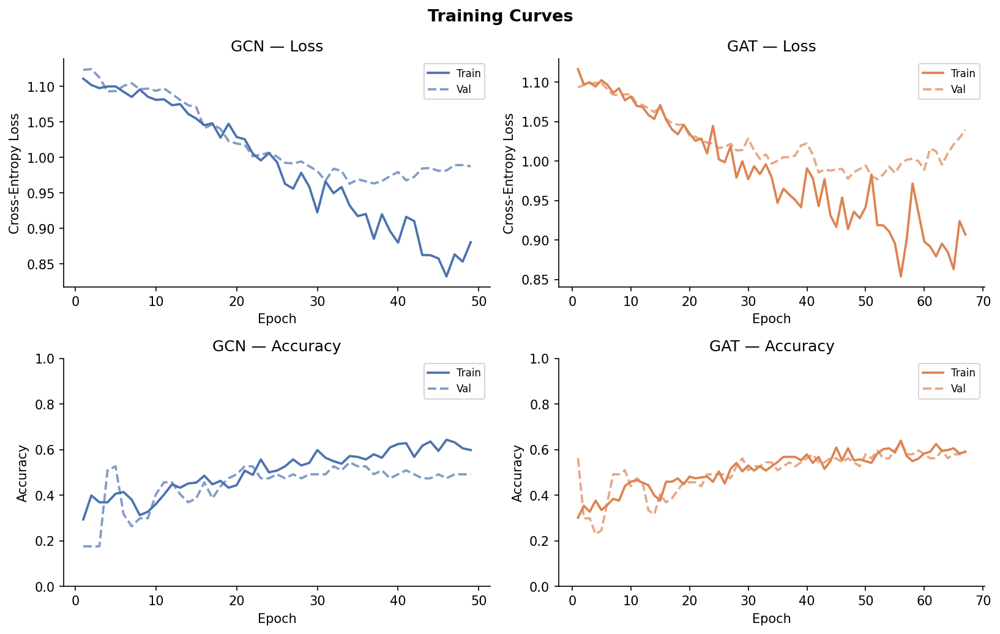

## Interpretability

### GAT Attention Formation Diagrams

After training, the final-layer attention weights are extracted and visualised
as formation diagrams. Raw softmax attention is biased toward nodes with few
incoming edges (e.g. the goalkeeper, who receives only ~4 back-passes), so
**relative attention** is used instead:

```
relative_attention_{i->j} = alpha_{i->j} * in_degree(j)
```

Values > 1 mean the model pays more attention to this edge than a uniform
distribution would. The 25 highest relative-attention edges among the 11
starting players are shown on a tactical-board layout.

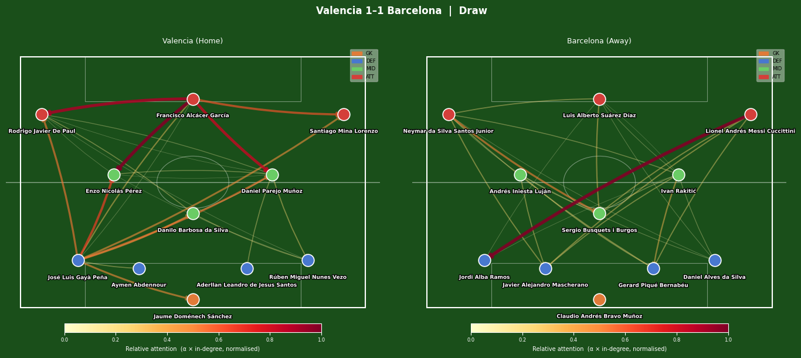
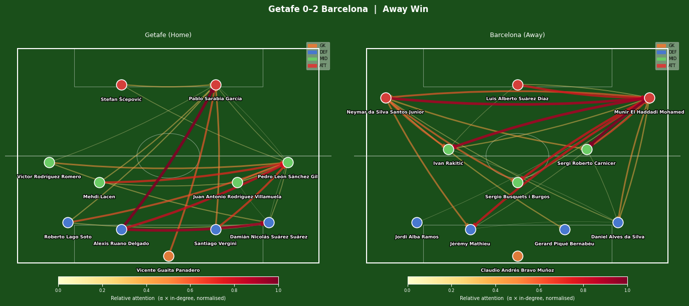
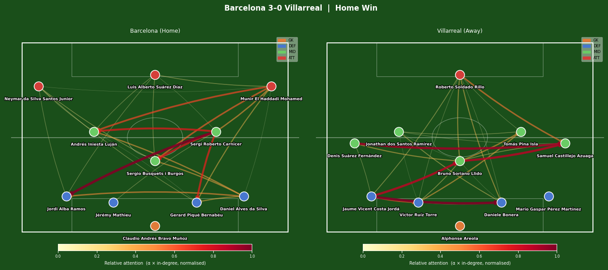

### Aggregate Position-Pair Heatmap

Attention weights averaged across all test-set matches, grouped by position
pair (GK / DEF / MID / ATT), reveal which structural pass relationships the
model consistently attends to regardless of team or opponent.

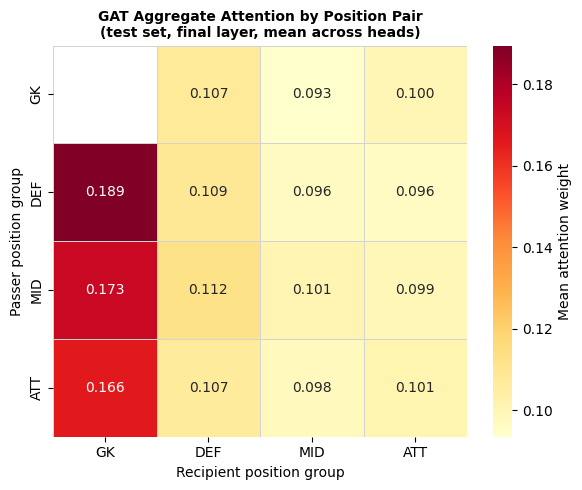

### t-SNE of Node Embeddings

GAT encoder output embeddings for all players across all matches are projected
to 2D with t-SNE (perplexity=40). Colouring by position group shows whether
the network learned position-aware representations from pass patterns alone,
without position being part of the supervision signal.

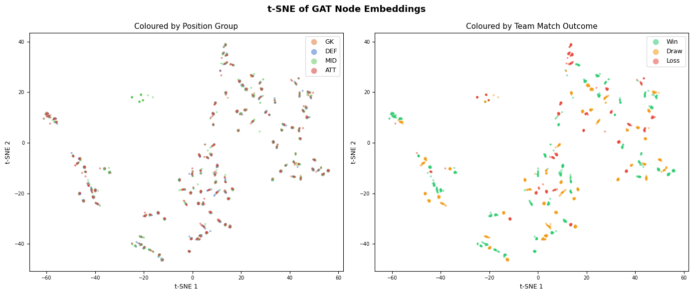

## GNNExplainer Analysis

A single interpretability visualisation risks overclaiming — it
presents one method's view of "what the model looks at" as if it
were the ground truth. This section tests whether two equally
reasonable methods (one post-hoc, one intrinsic) agree on which
player relationships matter, and finds that they do not.

GAT attention is *intrinsic*: the model exposes attention coefficients as part
of its forward pass, and they only exist for GAT.
[GNNExplainer](https://arxiv.org/abs/1903.03894) is *post-hoc*: it learns soft
node and edge masks that, when applied to the input, preserve the model's
prediction with as few elements as possible. It is model-agnostic and works
on the GCN, which has no attention mechanism of its own.

Running both interpretability methods lets us answer a concrete question:
**do the two methods agree on which player relationships matter?**

### Adapting GNNExplainer to a dual-encoder model

PyG's `GNNExplainer` expects a model with signature `model(x, edge_index, ...)`
operating on a *single* graph. The match classifier takes two graphs (home
and away) simultaneously. The fix is in
[src/evaluation/explainer.py](src/evaluation/explainer.py): a
`SingleGraphWrapper` pre-computes the *other* team's pooled embedding once at
construction time and stores it as a fixed buffer. The wrapper's `forward`
only runs message passing on the explained graph, so GNNExplainer's
edge-mask hook never sees a size mismatch. The wrapped output is verified
to be byte-identical to the underlying dual-encoder call.

### Per-match formation diagrams

For 6 test matches (2 home wins, 2 draws, 2 away wins) we run GNNExplainer
on the trained GCN. Each formation diagram overlays:

- **Node size:** GNNExplainer node-importance (larger = more important)
- **Edge thickness / colour:** GNNExplainer edge-importance (top 25 edges
  among the starting XI)

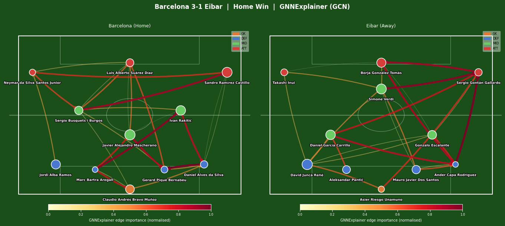
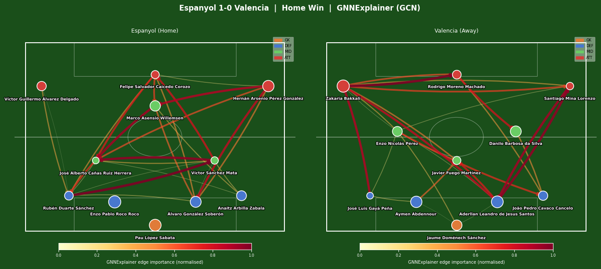
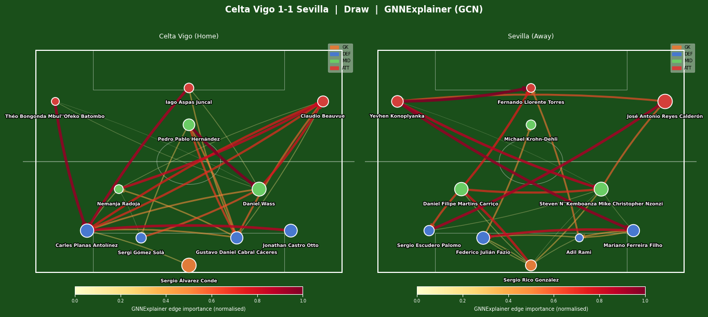
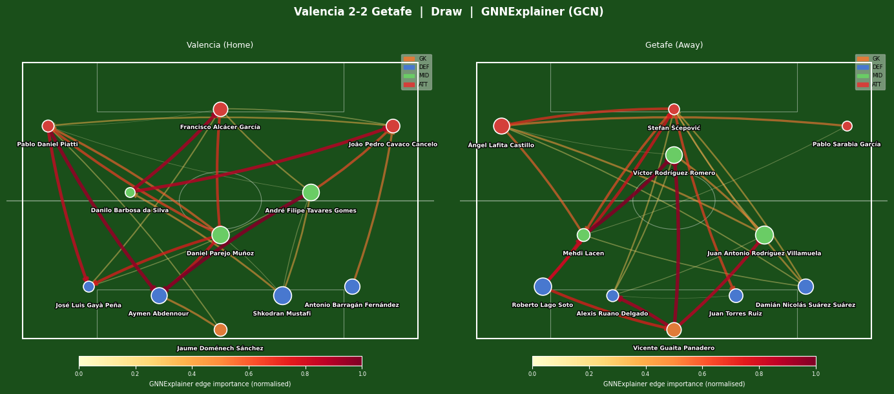
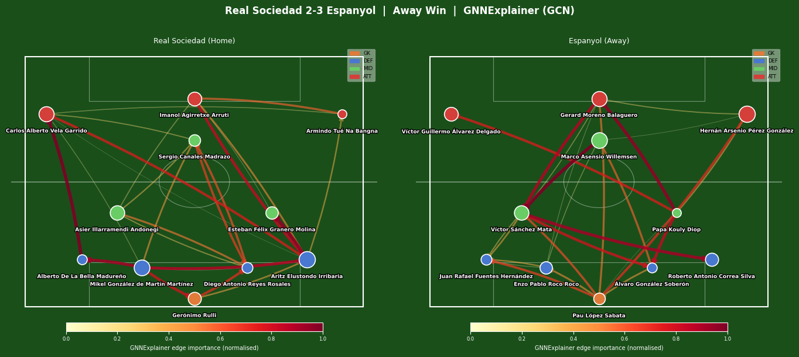
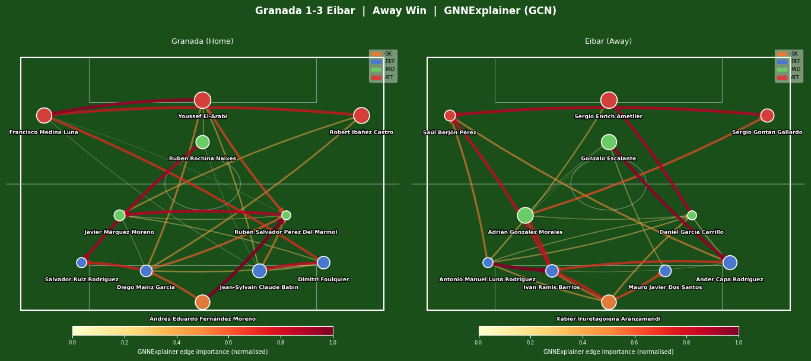

### Cross-method agreement

For each match we take the top-25 edges from GNNExplainer (on the GCN) and
the top-25 edges from GAT attention, treat each as a set of `(src, dst)`
tuples, and compute the Jaccard similarity. As a reference we sample two
random top-25 sets from the same edge population and average over 200 trials.

| Quantity | Value |
|---|---|
| Mean Jaccard (home graphs) | 0.095 |
| Mean Jaccard (away graphs) | 0.117 |
| Mean Jaccard (overall) | **0.106** |
| Random baseline (200 trials) | **0.131** |

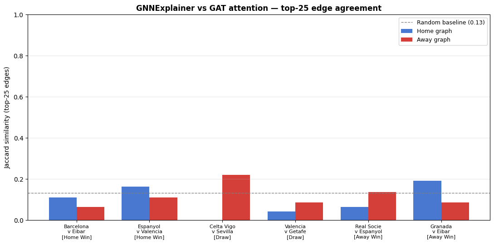

**The two methods agree at or below random chance.** This is a meaningful finding, not a bug.

GNNExplainer and GAT attention are explaining **different trained models** (a GCN and a GAT). The two architectures encode passing-network structure in different ways: the GCN scales messages by a single sigmoid-projected scalar per edge, while the GAT learns multi-head edge-conditioned attention. There is no a-priori reason their most-important edges should align. Even if the two methods were applied to the *same* model, post-hoc and intrinsic explanations are known to diverge: attention weights reflect what the network *uses* during the forward pass, while GNNExplainer identifies a minimal subgraph that *suffices* to recover the prediction. Multiple structurally different subgraphs can produce the same logits. The methodological take-away is that presenting a single interpretability visualisation as "what the model looks at" risks overclaiming: two equally reasonable methods can highlight entirely different player relationships.

Raw per-match agreement numbers are saved to
[`results/metrics/explainer_agreement.json`](results/metrics/explainer_agreement.json).

## Temporal Sensitivity Analysis

Both models are evaluated on first-half-only graphs (events from period 1)
and compared against their full-match performance from the main evaluation.
Full-match performance uses the originally trained checkpoints; only the
half-match models are retrained from scratch.

| Model | Full match | First half | Full − Half |
|---|---|---|---|
| GCN | 0.632 | 0.526 | **+0.106** |
| GAT | 0.684 | 0.491 | **+0.193** |

Mean edges per team graph: **115 (full match)** vs **77 (first half)**, a
33% reduction, confirming graphs are genuinely sparser, not just time-scaled.

**Interpretation:**

- Both models lose accuracy when restricted to the first half, but the **GAT
  drops more** (−19.3 pp vs −10.6 pp for GCN). This suggests that the
  edge-conditioned attention mechanism relies on richer, more stable pass
  statistics (frequency, success rate, length) that accumulate over the full
  match; the first 45 minutes do not provide enough passes to reliably
  differentiate passing tendencies.

- The **GCN's edge-weight projection** also benefits from fuller statistics,
  but its simpler aggregation (a single sigmoid-weighted scalar per edge) is
  less sensitive to the variance in per-edge statistics over smaller sample sizes.

- **Note on variance:** both half-match results come from a single training run.
  The direction of the effect (both models degrade, GAT more so) is meaningful;
  the exact magnitudes should be treated as indicative rather than precise.

The result confirms that **second-half passing data is informative** for both
architectures, and that the GAT's richer edge-feature conditioning makes it
more dependent on that additional data.

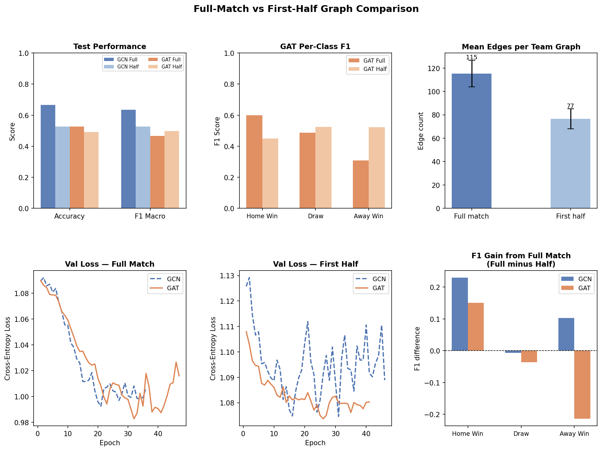

## Limitations

All models were trained in a single run with no repeated seeds, so
reported numbers carry unknown variance; the directional findings
(GNNs outperform baselines, GAT degrades more under sparser graphs)
are meaningful but exact magnitudes should be treated as indicative.
The dataset covers one season of one league (La Liga 2015/16, 380
matches), and findings may not generalise to other leagues or styles
of play. The GNNExplainer and GAT attention comparison involves two
different models (a GCN and a GAT respectively), so disagreement
between them reflects both method differences and model differences
and cannot be attributed to either alone. Finally, match outcome
prediction from passing networks alone discards a large fraction of
relevant information — set pieces, individual errors, goalkeeper
performance — that aggregate statistics partially capture and graphs
do not.

## Project Structure

```
relational-graph-learning/
├── data/
│   ├── raw/            # StatsBomb event pickles (cached, not committed)
│   └── processed/      # PyG graph datasets (cached, not committed)
├── results/
│   ├── metrics/        # JSON results and best model checkpoints (.pt)
│   └── plots/          # All output figures (PNG)
├── scripts/
│   ├── explore_data.py                # Step 1: StatsBomb data exploration
│   ├── inspect_events.py              # Step 1b: Event structure inspection
│   ├── build_dataset.py               # Step 2: Build and verify graph dataset
│   ├── train_models.py                # Step 3: Train GCN and GAT
│   ├── evaluate_models.py             # Step 4: Full evaluation + result plots
│   ├── visualize_interpretability.py  # Step 5: GAT attention + t-SNE plots
│   ├── compare_temporal.py            # Step 6: Full-match vs first-half comparison
│   ├── visualize_explainability.py    # Step 7: GNNExplainer + agreement analysis
│   └── main.py                        # uv project entry point
├── src/
│   ├── data/
│   │   ├── loader.py         # StatsBomb API wrapper with disk caching
│   │   ├── graph_builder.py  # Event data -> PyG Data graph construction
│   │   └── dataset.py        # MatchGraphDataset, MatchPair, split helpers
│   ├── models/
│   │   ├── base.py           # Shared dual-encoder + MLP classifier
│   │   ├── gcn.py            # GCNModel
│   │   └── gat.py            # GATModel with attention weight storage
│   ├── training/
│   │   ├── collate.py        # Custom collation for (home, away) graph pairs
│   │   └── trainer.py        # Training loop, early stopping, checkpointing
│   └── evaluation/
│       ├── metrics.py        # Accuracy, F1, confusion matrix utilities
│       ├── baseline.py       # Logistic regression + MLP baselines
│       ├── attention.py      # GAT attention extraction + formation diagrams
│       ├── explainer.py      # GNNExplainer wrapper for the dual-encoder GCN
│       └── temporal.py       # Graph structure stats for temporal analysis
├── pyproject.toml                     # Project metadata and dependencies
└── uv.lock                            # Locked dependency versions
```

## Reproducing the Results

Dependencies are managed with [uv](https://github.com/astral-sh/uv).

```bash
# Install dependencies
uv sync

# Run the full pipeline in order
uv run python scripts/explore_data.py                 # Verify data access
uv run python scripts/build_dataset.py                # Build graph dataset (~2 min first run)
uv run python scripts/train_models.py                 # Train GCN and GAT (~30 s on CPU)
uv run python scripts/evaluate_models.py              # Evaluate all models + generate plots
uv run python scripts/visualize_interpretability.py   # Attention + t-SNE plots
uv run python scripts/visualize_explainability.py     # GNNExplainer + agreement analysis
uv run python scripts/compare_temporal.py             # Temporal analysis (~3 min)
```

Data is fetched from the StatsBomb open data API on first run and cached
locally. No credentials are required.

## Dependencies

| Package | Purpose |
|---|---|
| `torch` + `torch-geometric` | GNN model definition and training |
| `statsbombpy` | StatsBomb open data API |
| `scikit-learn` | Baseline models, metrics, t-SNE |
| `pandas` / `numpy` | Data manipulation |
| `matplotlib` / `seaborn` | Visualisation |
| `tqdm` | Progress bars |

Python 3.13, managed with `uv`.

## References

Brody, S., Alon, U., & Yahav, E. (2022). *How Attentive are Graph Attention Networks?* ICLR 2022.

Kipf, T. N., & Welling, M. (2017). *Semi-Supervised Classification with Graph Convolutional Networks.* ICLR 2017.

Ying, R., Bourgeois, D., You, J., Zitnik, M., & Leskovec, J. (2019). *GNNExplainer: Generating Explanations for Graph Neural Networks.* NeurIPS 2019.

StatsBomb. (2018). *StatsBomb Open Data.* https://github.com/statsbomb/open-data
